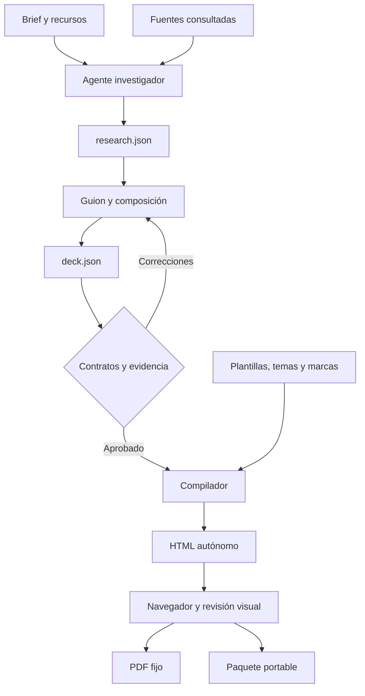

# Arquitectura del harness

## Límites del sistema

Lumen es una aplicación Node.js de ejecución local con un visor de presentaciones en el navegador. No requiere backend ni base de datos. El CLI es el cliente determinista del flujo. Los proveedores de agentes se conectan por adaptadores de proceso.

La revisión del agente evalúa evidencia y narrativa. La verificación automática del navegador detecta errores de ejecución, solicitudes externas y desbordamientos medibles. La revisión visual sigue siendo necesaria para detectar composición deficiente, gráficos engañosos o textos difíciles de leer.

## Artefactos y responsabilidad

| Artefacto | Produce | Consume |
| --- | --- | --- |
| brief.json | Usuario o agente con sus instrucciones | Plan de investigación, todos los roles |
| resources/ | Usuario y agente, según alcance | Investigación y composición |
| research-plan.json | CLI | Investigador |
| research.json | Investigador | Guionista, compositor y revisor |
| storyboard.json | Guionista | Compositor y revisor |
| deck.json | Compositor | Validador y renderizador |
| review.json | Revisor | Gate de evidencia |
| output/index.html | Compilador | Destinatario y exportador |
| output/manifest.json | Compilador | Integridad del paquete |
| output/presentation.pdf | Chromium | Lectura y distribución estática |
| runs/ | Harness | Diagnóstico y reanudación |

## Validación

El schema comprueba tipos, campos, tamaños e identificadores. Las reglas semánticas comprueban IDs únicos, referencias existentes, citas en slides factuales, longitudes de series, unidades, campos requeridos por layout, rutas locales de assets y desactivación de directivas de Mermaid.

La composición headless no puede introducir URLs ausentes de la investigación. La revisión no puede aprobar errores ni omitir slides factuales. El empaquetador comprueba que un PDF incluido pertenezca a la versión del HTML que distribuye. Estas reglas protegen coherencia y trazabilidad, pero no pueden comprobar por sí solas la veracidad de una fuente.

`accept` valida antes de sustituir un artefacto. El deck se valida en un directorio temporal antes de reemplazar `deck.json`. Los recursos de imagen deben vivir en resources/ para que esta validación sea portable. Si una etapa falla se conserva la respuesta en su directorio de ejecución y el comando termina con código distinto de cero.

## Ejecución de agentes

Cada etapa obtiene instrucciones de rol y los datos de entrada pertinentes. Se ejecuta el CLI elegido mediante `cross-spawn` y argumentos estructurados. El proceso devuelve JSON. El harness persiste el resultado; no necesita que el agente escriba la salida directamente.

Se conservan la autenticación, las herramientas web, las extensiones y los permisos del agente. El wrapper no establece una sandbox ni puede controlar todos los procesos remotos iniciados por el proveedor. La cancelación está acotada al proceso CLI hijo: se solicita terminarlo y se fuerza su terminación local si no responde. No promete cancelar tareas remotas que el proveedor haya desacoplado.

Los recibos de reanudación contienen un fingerprint del prompt, el adaptador y el modelo, más el hash del artefacto aceptado. Si las entradas o el resultado cambian, la etapa se repite. No hay caché de verdad factual: para actualizar noticias o datos cambia la fecha de corte y vuelve a investigar.

El reporte de ejecución agrega tiempo y tokens observados. Los consumos que el proveedor no comunica quedan como null. Un proceso simulado permite probar parsing y gates sin utilizar una cuenta o gastar tokens; la compatibilidad con un CLI real requiere una prueba autenticada en el entorno del usuario.

## Compilación y runtime

Handlebars convierte cada slide en HTML escapado. Los componentes enriquecidos se generan desde código confiable: KaTeX, tablas, imágenes incorporadas y fuentes locales. esbuild empaqueta solo las familias de funciones presentes en el deck. Las dependencias transitivas de Mermaid pueden seguir aportando un tamaño relevante, aunque la presentación tenga un solo diagrama.

El navegador utiliza Reveal para navegación, ECharts para SVG, Mermaid para diagramas y Three.js para 3D. El estado comparte tema y fuente. El runtime ofrece `ready` y `error` para coordinar exportación y QA. `preparePrint()` desactiva movimiento, reestablece gráficos y captura las escenas. El CSS de impresión usa 1280×720 px y una página por slide.

La compilación y la presentación no descargan recursos de red. El HTML establece una política que bloquea conexiones, assets remotos y formularios. Los enlaces de citas permanecen disponibles. Un template es código de confianza: quien lo modifica es responsable de mantener sus restricciones y la accesibilidad.

## Evolución prevista

La extensión inmediata consiste en más layouts y marcas sobre el contrato actual. Para funciones nuevas hay que añadir un schema y un renderer con su representación estática. Un editor visual, un buscador integrado, importación de documentos u otra salida como PPTX merecen adaptadores propios, conservando el contrato de evidencia.
